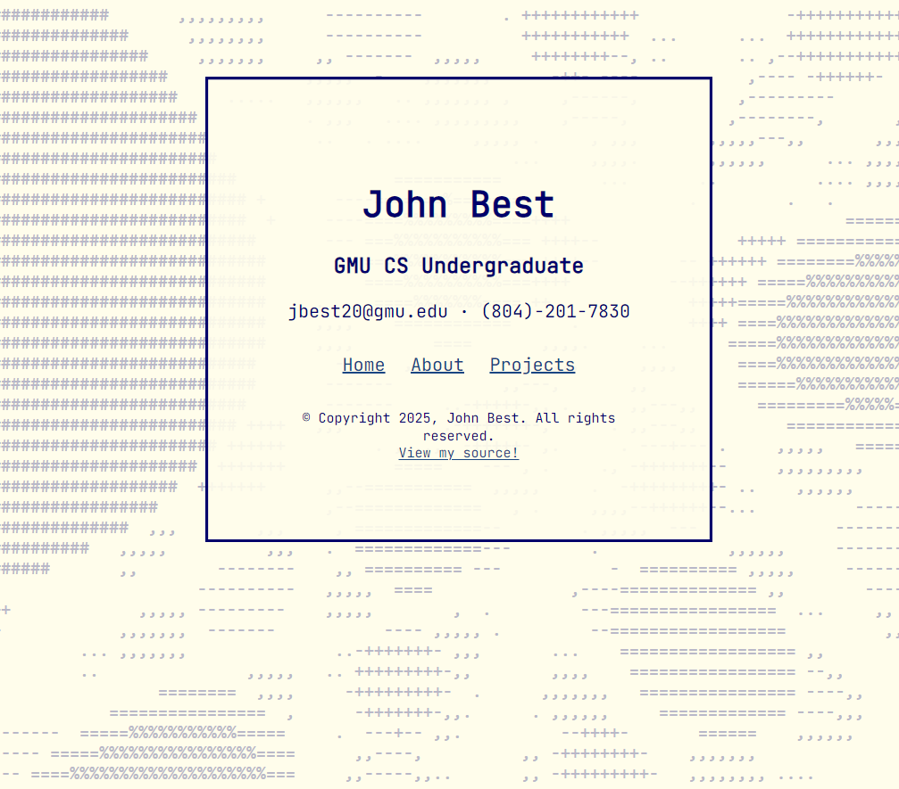
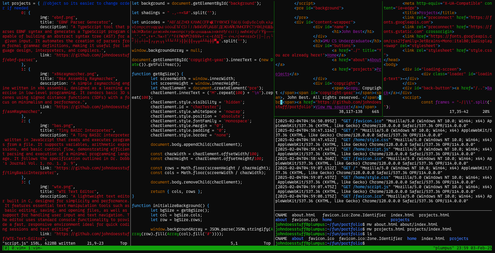

# Portfolio

## Hosted at [www.john-best.com](http://john-best.com)



My portfolio site! Only three pages but no framework and no runtime
dependencies. Everything ships as plain HTML, CSS and ES modules, with the
animated ASCII backgrounds compiled from C to WebAssembly (because C is awesome).



## Structure

```
index.html            home
about/                about
projects/             projects (the project list is an array in assets/js/projects.js -
                      there is probably a better way to do this but I really
                      don't want to hardcode these in the HTML)
assets/
  c/                  simulation sources
    build/            emcc output (committed because I am a chud with no build CI)
  css/                one stylesheet per page
  js/                 one background module per page, plus console.js
  images/
Makefile              wasm build + formatting
CNAME                 custom domain for GitHub Pages
```

Each page pairs a stylesheet with an ES module that drives its
`<pre id="background">`. `about.js` handles the small bit of content it computes at runtime.
Part of me wonders if having a realtime counter of how long I have been programming for is a
bit too tacky but I find it kind of charming so I will keep it for now.

## The backgrounds

Every page has a full-screen ASCII animation. The simulations are written in C
and compiled to WebAssembly with Emscripten. The JS side is just glue for the ascii
grid and mouse input.

- **The grid + font size are measured** `getScreenSize()` renders a 100×100
  block of `M` into a hidden `<pre>` and divides to get exact character metrics,
  so the simulation resolution follows the viewport and the font.
- **Frames are exported as bytes.** The C side writes ASCII directly into
  a linear buffer and JS reads it through a `Uint8Array`.
- **Characters are not square.** `reaction` and `fluid` simulate on a grid
  stretched by `VSCALE` to compensate for cells being roughly twice as tall as
  they are wide, then sample it back down per character. Both shade through the
  ramp `" .,-+=%#"`; the raymarcher uses a longer `" .,:-=+*#%@"`.
- **Each simulation also runs in a terminal.** All three have a `main()` that
  prints frames to stdout, so you can build one with a plain C compiler and
  watch it without a browser. Emscripten strips it from the wasm build.

## Building

The compiled `.js`/`.wasm` artifacts are committed, so you only need Emscripten
if you change something under `assets/c/`.

```sh
make          # rebuild all three modules into assets/c/build/
```

Each is built with `-O3`, `MODULARIZE`, `EXPORT_ES6` and `ALLOW_MEMORY_GROWTH`

To run a simulation in the terminal instead:

```sh
cc -O2 assets/c/fluid.c -lm -o /tmp/fluid && /tmp/fluid
```

## Running locally

To setup run:

```sh
python3 -m http.server 8000
```

Then visit `http://localhost:8000`

## Formatting

`clang-format` covers both the C and the JS (config in `.clang-format`,
build output excluded).

```sh
make format       # rewrite in place
make format-dry   # dry run.. does nothing
```
